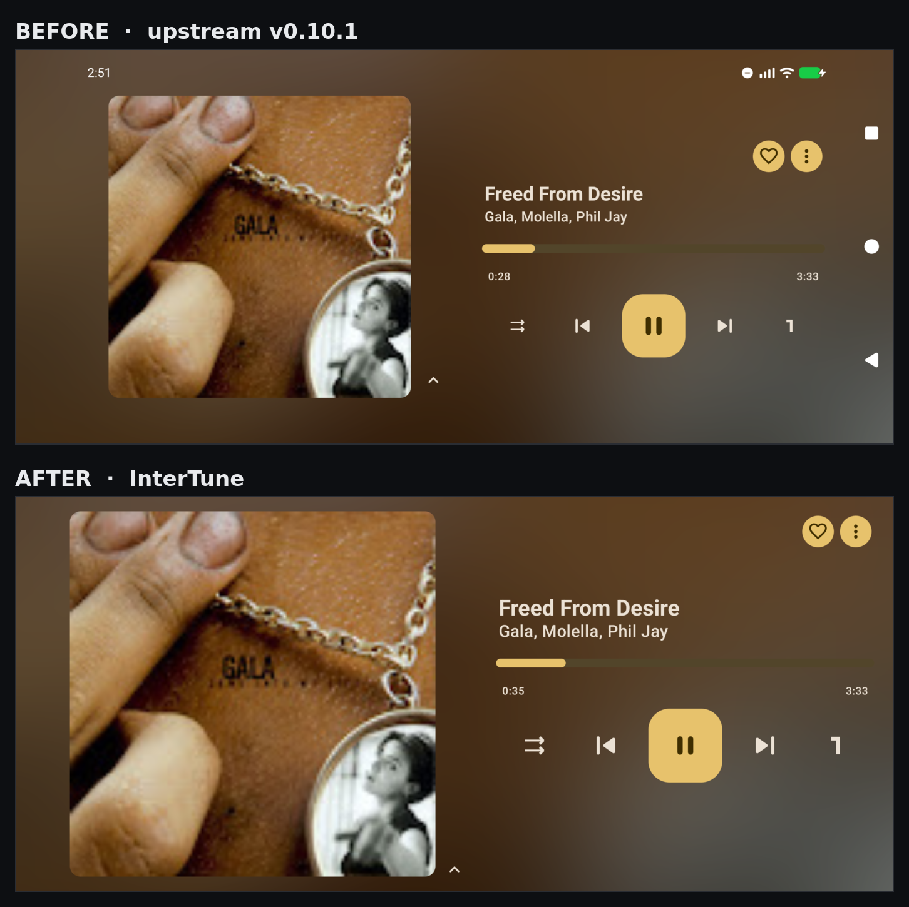

# InterTune


InnerTune ∩ OuterTune. A personal fork of [OuterTune](https://github.com/OuterTune/OuterTune),
carrying a fix that makes YouTube Music playback work again, plus a reworked landscape player.

> [!IMPORTANT]
> **This is a personal fork.** It exists because I use this app daily and wanted it working the way
> I like it. It is not a community project, not a drop-in replacement for upstream, and comes with
> no promise of support, releases, or timely updates. Use it if it's useful to you; file issues if
> you like, but expect them to be answered on a hobby schedule or not at all.
>
> If you want a maintained YouTube Music client, look at
> [Metrolist](https://github.com/MetrolistGroup/Metrolist) or
> [ArchiveTune](https://github.com/koiverse/ArchiveTune) — upstream's own README points there.

Ships as `dev.skye.intertune` with its own name and signing key, so it installs alongside upstream
OuterTune rather than fighting it. Note that this also means it cannot update an existing OuterTune
install in place — it is a separate app, and you migrate via Settings → Backup and restore.

## Why this fork exists

### The bug

Upstream OuterTune 0.10.1 stops playing partway through every track with:

```
Source error (2004): Response code: 403
```

Usually around 30 seconds in.

### The cause

In August 2026 YouTube began requiring a GVS proof-of-origin token from the `ANDROID_VR` and `IOS`
InnerTube clients. A client that owes a token and sends none is granted a **cold-start allowance of
roughly 1 MB** and then receives `403` for everything past it.

The allowance is on **data, not time**, which is why the cutoff moves with audio quality:

| Audio quality | Bitrate | ~Playback before 403 |
|---|---|---|
| High | 256 kbps | ~31 s |
| Default | 136 kbps | ~60 s |

Upstream lists `IOS` as its only fallback stream client. Worse, the resolution loop deliberately
skips `validateStatus` for whichever client is *last* in the list — and with a single-element list,
`IOS` is always last. So its capped URL is handed to the player unchecked. The check wouldn't have
caught it anyway: these URLs answer `206` at offset 0 and only `403` past the allowance.

Upstream discontinued YouTube Music support in February 2026 and marked this error
[Won't Fix](https://github.com/OuterTune/OuterTune/issues/735).

### The fix

Add the `VISIONOS` client (Apple Vision Pro, client ID 101), which is exempt from the token
requirement and needs no signature deobfuscation, and place it ahead of `IOS`.

Measured on device, 22 August 2026, same track and network:

| Client | Result |
|---|---|
| `VISIONOS` | full 6.13 MB track |
| `IOS` | **stopped at 1.05 MB (~51 s) → 403** |

`VISIONOS` does need a `visitorData` to clear YouTube's bot check, which the existing
`toContext` already supplies.

The fix itself is 3 files and ~50 lines, and touches no UI. It is deliberately a minimal diff
against `v0.10.1` rather than a rebase onto a newer upstream.

## Landscape player

Separate from the playback fix, the two-pane landscape now-playing screen got some work. Portrait
is deliberately untouched throughout — 0.10.1's portrait UI is the reason this fork is based on
0.10.1 at all.



Both shots are the same track on the same device, taken back to back: upstream `v0.10.1` built from
source, then this fork. The system bars are gone, the artwork is larger and sits against the outer
edge instead of floating in the middle of its half, the type and transport controls are bigger, and
the queue arrow sits at the bottom edge rather than in the gap beside the controls.

**The queue arrow no longer sits on top of the transport controls.** [`QueueSheet`][qs] pins its
expand arrow to the *top* of the collapsed sheet, and that sheet is `QueuePeekHeight` taller than
the peek it actually needs. In portrait, spending 96dp on that costs nothing. In landscape the
whole player is 384dp tall, so the extra 48dp both left the arrow floating in the middle of the
controls and came straight out of the artwork. Landscape now collapses to exactly the peek.

**Fullscreen and keep-awake while the player is open.** The system bars hide, an edge swipe brings
them back transiently, and they are restored when the player collapses or the device rotates. The
screen is held awake while playing — lyrics keep it awake independently, as before. Both are gated
on the player being *expanded*, so the mini player does not take over the screen, and on playback
being active, so a player left paused in landscape does not hold the screen on all night.

**Layout, sized for arm's length rather than in-hand.** Gutter 32dp → 24dp, title 22sp → 25sp,
artist 16sp → 19sp, artwork hugging the outer edge at ~86% of screen height, like/more aligned to
the artwork's top edge, transport icons 32dp → 42dp and the play button 72dp → 84dp.

[qs]: app/src/main/java/com/dd3boh/outertune/ui/player/Queue.kt

Two defects in the first cut of this are worth recording, because neither was visible in a
screenshot and both are easy to reintroduce:

- `View.keepScreenOn` is a single boolean on a single View. `Thumbnail` owned it for lyrics and the
  new immersive effect owned it for landscape, so whichever disposed last silently cleared the
  other's request — breaking lyrics keep-awake **in portrait**. One owner now ORs both conditions.
- `WindowInsets.systemBars` shrinks when the bars hide, and that value reaches `collapsedBound`,
  which is a `remember()` key for the sheet state. Toggling the bars rebuilt the state mid-drag,
  cancelled the gesture and re-animated the sheet to its previous anchor, so the player sprang back
  open instead of collapsing. Both sheet bounds now read `systemBarsIgnoringVisibility`.

## Artwork

Two separate resolution bugs, both of which the larger landscape artwork made obvious.

**Remote covers were fetched at the wrong size.** `getThumbnailModel(sizeX, sizeY)` took a size and
used it only for local files; for YouTube artwork it returned the raw url and ignored both
arguments. YouTube serves a small thumbnail by default, so the player was upscaling it. The size now
goes into the url, and `Thumbnail` passes the size its own `BoxWithConstraints` already measured.

**Local covers collided in the image cache**, which is upstream
[#798](https://github.com/OuterTune/OuterTune/issues/798). `ItemThumbnail` defaults its size to `-1`
when a caller does not pass one, and the Coil cache key is built from that size, so every size of a
given file shared the key `path;-1;-1`. Coil samples a bitmap down to whatever asked for it first,
so a 48dp list row could poison the entry a 96dp grid cell then upscaled. That is why it looked
fine on the album page and pixelated in the grid, and why it seemed to depend on which screen you
opened first. The size now falls back to the size the thumbnail is actually drawn at.

## Relationship to upstream

Based on upstream tag **`v0.10.1`**. It is *not* based on the `lite` branch (which has the YouTube
code removed entirely) or on newer forks — I prefer 0.10.1's UI and behaviour, so this stays close
to it.

Credit where it's due: OuterTune is a fork of [InnerTune](https://github.com/z-huang/InnerTune) by
z-huang, and the heavy lifting here is all upstream's. Also worth acknowledging
[yuuichi-s/OuterTune](https://github.com/yuuichi-s/OuterTune), an actively developed fork that
reached the same `VISIONOS` conclusion independently.

## Expect this to break again

`VISIONOS` is exempt because YouTube hasn't gotten to it yet, not because it's blessed. yt-dlp
re-pinned its YouTube client versions three times during 2026. When this stops working, the fix is
likely a client version bump in `YouTubeClient.kt` rather than anything structural.

## Building

Requires **JDK 17** and the Android SDK. Upstream `v0.10.1` does not build from a clean checkout
today; two of the fixes below are commits in this repo, the other two are SDK components you need
installed:

| Needed | Why |
|---|---|
| `platforms;android-36` | `compileSdk = 36` |
| `ndk;29.0.13113456` | native modules `ffMetadataEx` and `taglib` |
| `cmake;3.31.6` | taglib's build |
| SDK licences accepted | `sdkmanager --licenses` |

```bash
git clone --recurse-submodules https://github.com/ItzSkyeYT/InterTune.git
cd InterTune
./gradlew assembleCoreDebug
```

`--recurse-submodules` matters: `taglib` pulls its own submodules and the build fails
without them.

Flavors are `core` (default, smaller) and `full` (adds FFmpeg codecs — ALAC/APE/WavPack/DSD).
Debug builds use the applicationId suffix `.debug`, so a debug and a release build coexist.

Release builds are signed from a gitignored `keystore.properties` at the repo root:

```properties
storeFile=/path/to/your.jks
keyAlias=youralias
storePassword=...
keyPassword=...
```

Without that file the release variant has no signing config and will not assemble.

On a memory-constrained machine, `--max-workers=2` avoids the OOM killer during the native build.

## Licence

GPL-3.0, inherited from upstream. See [LICENSE](LICENSE).
