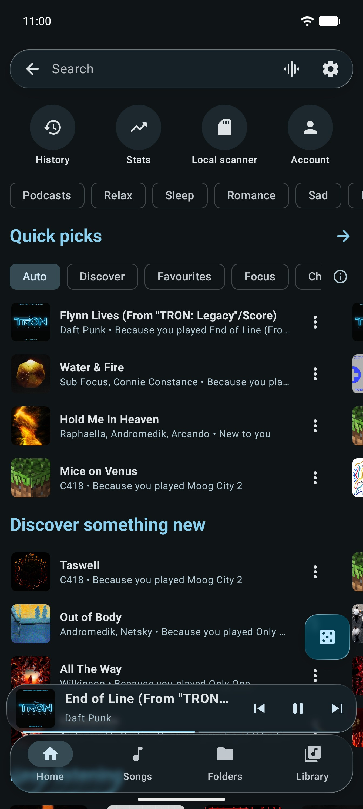
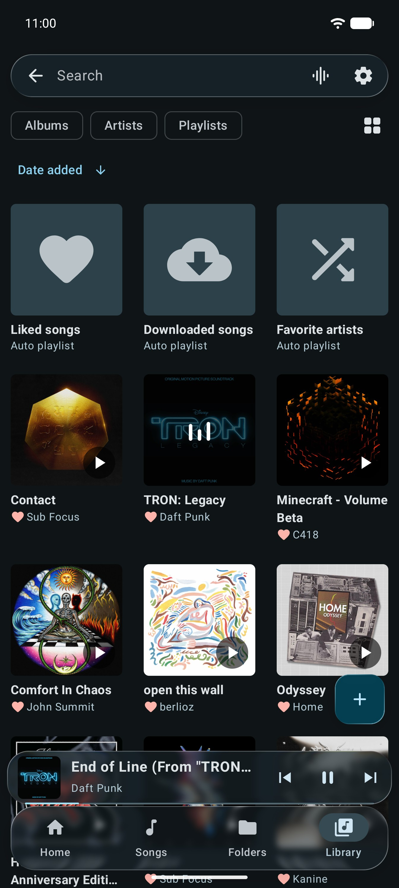
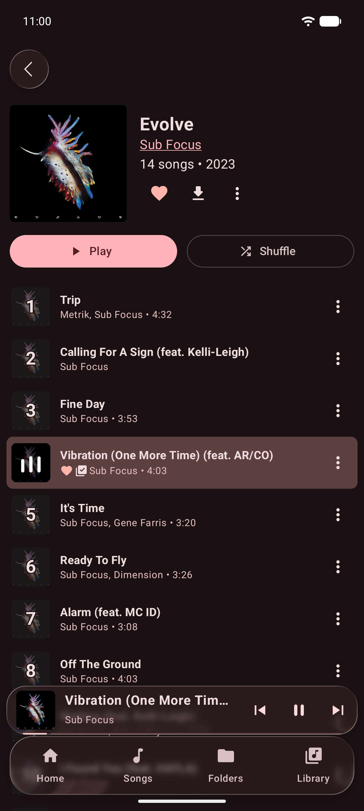
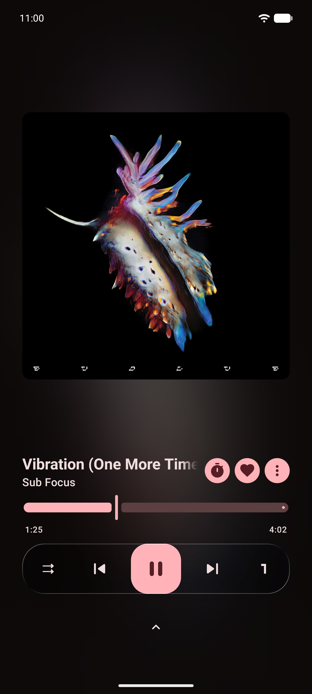
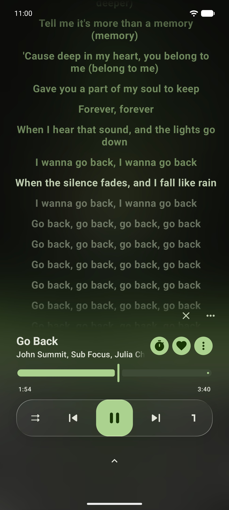
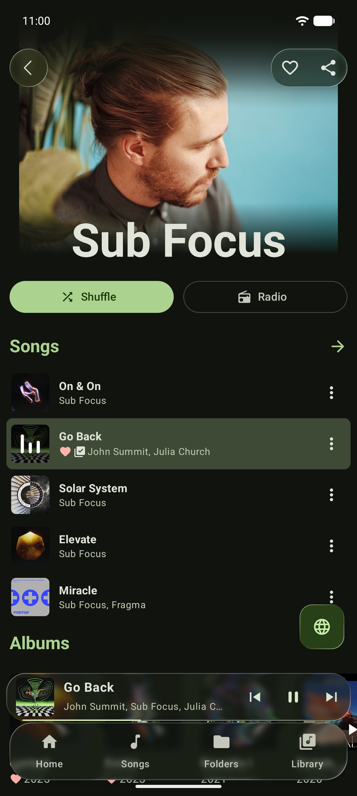
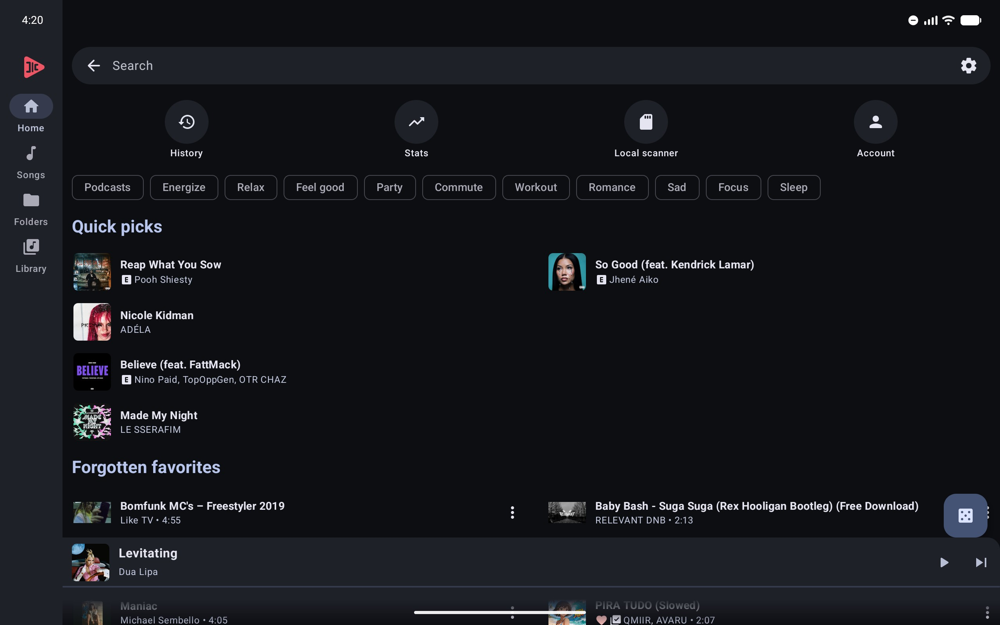

> [!WARNING]
>
> **The "InterTune" on Google Play is not this app.** It is published by VISCALE LTD as `com.intertune.playback`, has nothing to do with this project, and shows ads. This InterTune has never been on Google Play.
>
> **Neither is the "InterTune" on APK sites** such as APKPure, APKCombo, Aptoide and Softonic. That is `com.mta.intertune`, an older app by MTA Inc with ads, which was removed from Google Play in September 2026 and closes itself on launch when it was not installed from Play.
>
> InterTune will never have ads or tracking. If you installed the Play Store one, uninstall it and get InterTune from the [releases page](https://github.com/ItzSkyeYT/InterTune/releases/latest). You are welcome to report it to Google with [this form](https://support.google.com/googleplay/android-developer/contact/policy_violation_report).

<div align="center">


# InterTune

**An Android music player for YouTube Music and local files. A fork of OuterTune 0.10.1 that fixes its playback and adds recommendations that learn how you listen, song recognition and spatial audio.**

<sub>InnerTune ∩ OuterTune</sub>

[](https://github.com/ItzSkyeYT/InterTune/releases/latest) [](https://discord.gg/68jmqhMjXk)

[Download](#download) · [Why playback breaks](docs/403.md) · [What changed and why](docs/CHANGES.md) · [Wiki](https://github.com/ItzSkyeYT/InterTune/wiki) · [Discord](https://discord.gg/68jmqhMjXk)

</div>

## Download

> [!CAUTION]
> Only download InterTune from this page. The apps of the same name on Google Play and on APK sites are not ours.

**[Download the latest APK](https://github.com/ItzSkyeYT/InterTune/releases/latest)**

One signed APK per release. Requires Android 7.0 or later. Sideload it, or point [Obtainium](https://github.com/ImranR98/Obtainium) at this repo.

From 0.10.4 onward you only need this page once. Turn update checking on and InterTune finds new releases itself, shows you what changed, and installs them with your confirmation.

> [!IMPORTANT]
>
> InterTune installs alongside OuterTune, so both can sit on the device at once: it ships as `dev.skye.intertune`, not upstream's `com.dd3boh.outertune`. That also means it cannot update an existing OuterTune install in place. Back up in OuterTune first (**Settings → Backup and restore**), then restore into InterTune from the same screen. Do not uninstall OuterTune until the restore has finished.

## Screenshots

<div align="center">

| | | |
|:-:|:-:|:-:|
|  |  |  |
| Player | Lyrics | Queue |
|  |  |  |
| Library | Album | Artist |



The tablet and landscape layout.

</div>

## What InterTune adds

OuterTune 0.10.1 already had local files, downloads, account sync, synced lyrics, multiple queues and Android Auto. This is what InterTune adds on top. Fixes apply to everyone. New settings start off, except where a line below says otherwise.

### Playback

- **Songs play all the way through.** Upstream 0.10.1 stops every YouTube track 30 to 60 seconds in with `Source error (2004): Response code: 403` ([#1284](https://github.com/OuterTune/OuterTune/issues/1284), [#1282](https://github.com/OuterTune/OuterTune/issues/1282)). Streams and downloads now come from a client YouTube still serves in full. [Why](docs/403.md)
- **Use my account to play.** When YouTube refuses a song without an account, playback can also ask as you, if you are signed in: never, only when a song is refused (the default), or always. Whether YouTube honours it for age-restricted songs is not confirmed yet.
- **The "not a bot" block is handled rather than displayed.** It is YouTube rate limiting your connection and cannot be fixed from the app, but InterTune now says in words what is happening and stops background downloads and syncs from hammering it.
- **Playback no longer hangs until a force stop.** A token request with no time limit, and a "Wait to reconnect" that never gave up, both used to hold a song for good. The wait now has a limit, and the reconnect tries again on a timer.
- **Play starts on the first tap** after the app has been left alone. It used to take up to three.
- **Fade between tracks**, from 2 to 12 seconds. Songs do not overlap, so it is not a crossfade, and songs from one album play straight through.
- **The sleep timer fades out** (on by default) instead of cutting off, shows its countdown in a notification, and has its own button beside the like button on the player.
- **Keep the queue up to date** (on by default, for songs InterTune queued itself) drops songs further down that stop suiting what you are playing.
- **Let other apps play at the same time**, for music over a video. The cost is that InterTune then stops lowering itself for navigation prompts and alarms. Android still mutes it for calls.
- **Highest available audio quality**, and a readout of the codec, bitrate and sample rate actually playing. Raising the quality fetches songs cached at a lower one again the next time they play. Songs cached before 0.11 are left as they are.

### Recommendations

- **Best recommendations (experimental)**, a Quick picks source built on the phone from how you listen: what you finish, skip, search for, like and come back to. It learns from the cards you play and the ones you pass over. A new install starts on it; an update keeps the source you had.
- **Why these?** Tap the Quick picks heading to see the songs the row was built around. A line under each card (on by default) says what put it there, and a long press offers Not this song, Less of this artist or Never this artist.
- **Adventurousness and Familiarity dials**, New songs only, and context chips for Discover, Favourites, Focus, Chill and Party. They steer the row while Quick picks is on Best recommendations or Try both.
- **Try both (experimental)** mixes Best recommendations with the YouTube Music or library row, card for card, so you can compare them.
- **Discover something new** (on by default) is a second row of songs you have never played.
- **Similar songs from Last.fm** as well as YouTube, if you say yes when asked. Until you answer, nothing is sent to Last.fm.
- **How it's doing**, under Settings > Recommendations, shows how often you play what each source puts in front of you, and what the engine has learned against where it started. Learning can be paused, reset or exported.
- **Quick picks that behaves.** It is YouTube's real Quick picks shelf rather than a shelf of hour-long mixes, pull to refresh brings songs that were not there before, and it never shows previews or more than two songs by one artist.
- **Rank with your listening** and **Tidy Home rows** (both on by default) order the YouTube Music and library rows by what you tend to finish, and keep out what you just heard and other versions of one song.

### Song recognition

- **What's playing?** Tap the waveform in the search bar: Shazam names the song and InterTune finds it on YouTube Music to play or add. No account needed, and on headphones your own music keeps playing while it listens.
- **Keep listening** carries on in the background with the screen off, lists everything it hears, and can put every song it hears into one playlist. Your playlists also have a listen button to fill them with what is playing around you.
- **It knows which version is playing**: a sped-up or slowed edit by how fast it plays, and, in Keep listening, a mashup or remix rather than its pieces.

### Sound

- **Spatial audio on any headphones.** The stereo mix plays through a pair of virtual speakers in front of you, using measured ear responses, with a stage width from 15 to 90 degrees.
- **Head tracking** (Android 13 and later), on headphones that report their orientation and a phone that passes it on (many phones do not): the music stays where it is when you turn your head. The settings say whether yours can.
- **Quieter as you walk away** (Android 12 and later, Bluetooth headphones): the volume falls as you leave the phone behind and comes back as you return.
- **Volume levelling that levels** ([#116](https://github.com/OuterTune/OuterTune/issues/116)), plus **Fix song volumes** for songs whose loudness data went missing. It can still only turn songs down, never up, and the volume slider now goes past 100%.

### Player and look

- **A landscape player built for the shape of the screen.** Bigger artwork and controls, no system bars, and a queue arrow that stops swallowing the transport buttons ([#1133](https://github.com/OuterTune/OuterTune/issues/1133)). On tablets in landscape the queue sits beside the player.
- **Sharp artwork on the player.** YouTube covers there were fetched at 120px and stretched ([#1247](https://github.com/OuterTune/OuterTune/issues/1247)).
- **Liquid glass** (off by default): the bottom bar, mini player and player controls become frosted glass over whatever scrolls beneath them. The refraction half needs Android 13 or newer.
- **Player buttons**: Classic, or Connected in one frosted row. The seekbar is the M3E one, and top bars float the way One UI 8 draws them.

### Library

- **Automatic backups** of your library, playlists, settings and listening history to a folder you pick, from every 6 hours to once a year, keeping 1 to 20.
- **Liked songs can download themselves**, all at once or as you like them, and any download can wait for Wi-Fi. Un-liking never deletes a download.
- **Save the queue as a playlist**, export every playlist as M3U in one go, and remove several songs from a playlist at once ([#1172](https://github.com/OuterTune/OuterTune/issues/1172)). M3U import finds the right track again ([#679](https://github.com/OuterTune/OuterTune/issues/679)).
- **Sync that does not lose things.** Read only sync no longer changes your YouTube Music account, a failed or partial sync no longer removes songs or playlists, and signing in no longer takes back likes you made while signed out.
- **Last.fm scrobbling.** You sign in on Last.fm's own page, so InterTune never sees your password.
- **Stats that say something**: how much you listened against the period before, the hours you listen at, and the song you played most in one day. Nothing leaves the phone.

### Home screen and Android Auto

- **A home screen widget**: what's playing with its controls, and a list under it such as Quick picks or Recently played. It works with the app closed, changes shape with its size, and each one is set up on its own.
- **"Hey Google, play"** in Android Auto plays the match from your library, and a list started in the car becomes the queue. Automation apps that ask for a song by name reach InterTune too.

### Updates and privacy

- **Updates that arrive in the app** ([#502](https://github.com/OuterTune/OuterTune/issues/502), [#1046](https://github.com/OuterTune/OuterTune/issues/1046)). If you let it, InterTune checks GitHub, shows what changed, downloads the APK and hands it to Android, which still asks you to confirm every install.
- **Crash reports**: after a crash, InterTune offers to report it on GitHub the next time it opens, with the error filled in. Nothing is sent unless you choose.
- **An anonymous install count, only if you say yes**: once a day, a random name replaced every month, the app and Android versions, and whether it came from F-Droid. Nothing about what you listen to.

Smaller repairs are listed in [docs/CHANGES.md](docs/CHANGES.md#smaller-fixes), along with [what this does and does not answer upstream](docs/CHANGES.md#upstream-issues), such as searching the word "null" crashing the app ([#1190](https://github.com/OuterTune/OuterTune/issues/1190)).

## Why it exists

Since August 2026 YouTube has required a GVS proof-of-origin token from the InnerTube clients upstream streams with. A client that owes a token and sends none gets a cold-start allowance of roughly 1 MB, then `403` for everything past it. **The allowance is on data, not time**, which is why the cutoff moves with audio quality: about 31 seconds at 256 kbps, about 60 at 136. Upstream wound down in early 2026 and says it is no longer in active development, and its [playback-errors megathread](https://github.com/OuterTune/OuterTune/issues/735) was closed as not planned in April, before this particular regression began. InterTune adds the `VISIONOS` client, which is exempt, and places it ahead of `IOS`. [The write-up, with the measurements](docs/403.md). Not every 403 is this one. Songs YouTube will only play for an account ([#972](https://github.com/OuterTune/OuterTune/issues/972)) may still fail, and the "not a bot" block ([#1103](https://github.com/OuterTune/OuterTune/issues/1103)) is [explained](docs/CHANGES.md#when-youtube-refuses-the-connection), not fixed.

That fix was about fifty lines in three files. InterTune has grown a long way past it since, and has a [Discord](https://discord.gg/68jmqhMjXk). It has been submitted to F-Droid and is not in it yet.

InterTune is pinned to upstream `v0.10.1` and does not follow upstream forward; its own version numbers carry on from there and do not correspond to upstream releases. 0.10.1's portrait now-playing screen is the reason this fork is based on 0.10.1 at all, so its layout is kept, and new controls go beside the old ones rather than moving them. I use this daily, [issues](https://github.com/ItzSkyeYT/InterTune/issues) get read, and you should [expect playback to break again](docs/403.md#expect-this-to-break-again) whenever YouTube changes something.

## Translations

InterTune has translations for 48 locales, but only French covers nearly everything. In 27 others about a sixth of what this fork added is translated and the rest is still English, and 20 have only the strings InnerTune started with. What is there was mostly not written by native speakers, so some of it will read oddly and some of it will simply be wrong. **If anything sounds off in your language, please [say so](https://github.com/ItzSkyeYT/InterTune/issues/new?template=translation_report.yml).** A one line report is enough, a suggested wording is a bonus, and you do not need to open a pull request. Corrections are welcome and nobody minds being told.

**Translations are managed with [Weblate](https://hosted.weblate.org/engage/intertune/).** No account juggling and no XML: pick your language, type, and the changes arrive here. There is plenty to do.

The oldest strings, the ones InnerTune started with, are not on InterTune's Weblate. If one of those is wrong in your language, [say so](https://github.com/ItzSkyeYT/InterTune/issues/new?template=translation_report.yml) the same way.

## Building

```bash
git clone --recurse-submodules https://github.com/ItzSkyeYT/InterTune.git
cd InterTune
./gradlew assembleCoreDebug
```

Needs JDK 21 and an Android SDK carrying `platforms;android-36`, `ndk;29.0.13113456` and `cmake;3.31.6`, with the licences accepted. `--recurse-submodules` matters: `taglib` pulls its own submodules and the build fails without them. No keys are needed. A release build is unsigned unless you add a `keystore.properties`, and one not signed with the InterTune release key leaves out Last.fm, questions and news, and the install count; debug builds keep them. Flavours, signing and the rest are in [docs/BUILDING.md](docs/BUILDING.md).

## Star History

<a href="https://www.star-history.com/?repos=itzskyeyt%2Fintertune&type=date&legend=top-left">
 <picture>
   <source media="(prefers-color-scheme: dark)" srcset="https://api.star-history.com/chart?repos=itzskyeyt/intertune&type=date&theme=dark&legend=top-left" />
   <source media="(prefers-color-scheme: light)" srcset="https://api.star-history.com/chart?repos=itzskyeyt/intertune&type=date&legend=top-left" />
   
 </picture>
</a>

### Thank You so much everyone for your support in this growing project!

## Credits

[InnerTune](https://github.com/z-huang/InnerTune) by z-huang, forked into [OuterTune](https://github.com/OuterTune/OuterTune), which is where the heavy lifting is. [AsterTune](https://github.com/yuuichi-s/AsterTune) reached the same `VISIONOS` conclusion independently. Several other fixes here were rewritten from it against 0.10.1 rather than cherry-picked. The m3u import bugs were reported by [cchery2512](https://github.com/cchery2512). Liquid glass was [rii2609](https://github.com/rii2609)'s idea, and he caught the intensity slider running backwards. It is built on [AndroidLiquidGlass](https://github.com/Kyant0/AndroidLiquidGlass) (`io.github.kyant0:backdrop`, Apache-2.0). Lyrics matching folds Traditional Chinese to Simplified with a table from [ICU](https://icu.unicode.org) (Unicode License v3, notice in [docs/licenses](docs/licenses/ICU-Unicode-3.0.txt)).

Song recognition computes Shazam's fingerprint with a Kotlin port of [SongRec](https://github.com/marin-m/SongRec) by marin-m, by way of the `songrecfp` crate in [Audile](https://github.com/AudileTeam/Audile) by Aleksey Saenko, both GPL-3.0. Spatial audio uses the SADIE head-related impulse responses, measured by the University of York's Audio Lab and taken from Google's [Resonance Audio](https://github.com/resonance-audio/resonance-audio) (Apache-2.0, licence in [docs/hrtf](docs/hrtf/LICENSE.SADIE)).

## Licence

GPL-3.0-only. See [LICENSE](LICENSE).

The file headers say `GPL-3.0`, which SPDX deprecated because it does not say whether a later version of the licence may be used. They come from upstream, and a fork cannot hand out a permission its upstream never gave, so the project reads them the conservative way: version 3, and version 3 only. If OuterTune or InnerTune ever say otherwise, this follows them.

Copyright © 2024 z-huang/InnerTune<br>
Copyright © 2025 OuterTune Project<br>
Copyright © 2026 ItzSkyeYT
